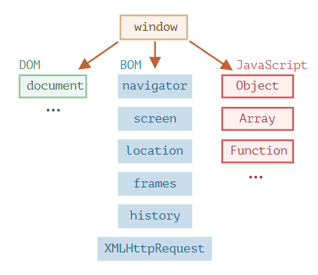

## BOM에 대해서 설명해주세요

`BOM(Browser Object Model)` 은 문서 이외의 것을 조작하기 위해서 브라우저가 제공하는 객체입니다. `BOM` 객체를 활용해서 브라우저로 새로운 창을 연다거나, 창의 크기를 조정한다거나, ajax 요청을 하는 등의 조작이 가능합니다.  

`navigator`, `screen`, `location`, `frames`, `history`, `XMLHttpRequest` 등의 객체가 이에 해당합니다.

## DOM에 대해서 설명해주세요
  

`DOM(Document Object Model)` 는 `HTML` 문서를 파싱하여 나온 결과물로 화면에 그려줄 요소의 정보를 표현하고 조작할 수 있는 구조입니다.  

최상위에는 `document` 객체가 존재하며, 자바스크립트의 `DOM API` 를 사용하여 화면에 보여줄 내용을 동적으로 조작할 수 있습니다.  

## 참고 자료
[브라우저 환경과 다양한 명세서 (코어 자바스크립트)](https://ko.javascript.info/browser-environment)  
[W3C DOM Level 1 Core 사용하기](https://developer.mozilla.org/ko/docs/Web/API/Document_object_model/Using_the_Document_Object_Model)  
