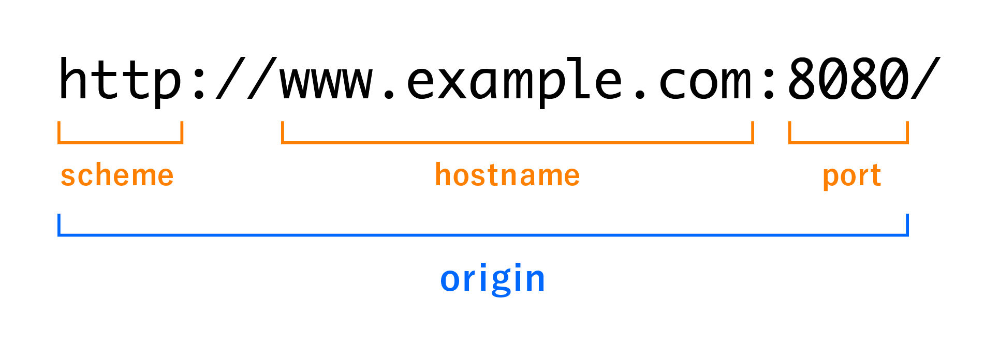

## CORS에 대해서 설명해주세요
브라우저에는 기본적으로 다른 출처에 대한 요청을 차단하는 `SOP` 정책이 존재하는데 `CORS(Cross-Origin Resource Sharing)` 는 이를 완화하여 다른 출처에 대한 요청을 허용하는 개념입니다.

웹 애플리케이션이 지금처럼 복잡하지 않았을 때엔 HTML 파일을 제공해주는 서버가 동일한 경우가 많았기에 큰 어려움은 없었지만, 프론트 서버와 API 서버가 따로 존재하는 경우가 많은 현재에는 이런 `CORS 설정` 이 중요합니다.

## SOP가 무엇인가요?
`SOP(Same-Origin Pocily)` 는 보안을 목적으로 브라우저 상에서 같은 출처에서의 요청만 허용하는 정책입니다.

웹 애플리케이션은 누구나 개발자 도구를 열어서 자바스크립트를 조작하는 행위가 가능한만큼 `XSS(Cross-Site Scripting)`, `CSRF(Cross-Site Request Forgery)` 같은 공격에 취약합니다. 그렇기에 한 출처에서 다른 출처로 함부러 요청하는 행위를 막아놓은 것입니다.

## 같은 출처의 기준은?
  

`URL` 에는 많은 부분이 있는데 **프로토콜 + 호스트 이름 + 포트**가 동일하다면 `Same-Origin` 으로 인식합니다. 그 외의 것인 모두 `Cross-Origin` 이 됩니다.  

## CORS의 기본 동작
1. 클라이언트가 HTTP 요청을 할 때 헤더의 `Origin` 필드에 자신의 출처 정보를 담아서 보냅니다.  
2. 서버는 HTTP 응답 패킷의 헤더에 `Access-Control-Allow-Origin` 정보를 담아서 보냅니다. 이 정보는 어떤 출처로부터 오는 요청을 허락할 것인지를 나타냅니다.  
3. 클라이언트는 자신이 보낸 `Origin` 필드와 서버가 보내준 `Access-Control-Allow-Origin` 필드를 비교합니다. 만약 자신을 허락하지 않는 서버였다면 그 응답을 사용하지 않고 버리고 CORS 에러를 발생시킵니다.  

## 참고 자료
[CORS는 왜 이렇게 우리를 힘들게 하는걸까?](https://evan-moon.github.io/2020/05/21/about-cors/)  
[🌐 악명 높은 CORS 개념 & 해결법 - 정리 끝판왕 👏](https://inpa.tistory.com/entry/WEB-%F0%9F%93%9A-CORS-%F0%9F%92%AF-%EC%A0%95%EB%A6%AC-%ED%95%B4%EA%B2%B0-%EB%B0%A9%EB%B2%95-%F0%9F%91%8F)

## 이미지 출처
https://yamory.io/blog/about-cors/
